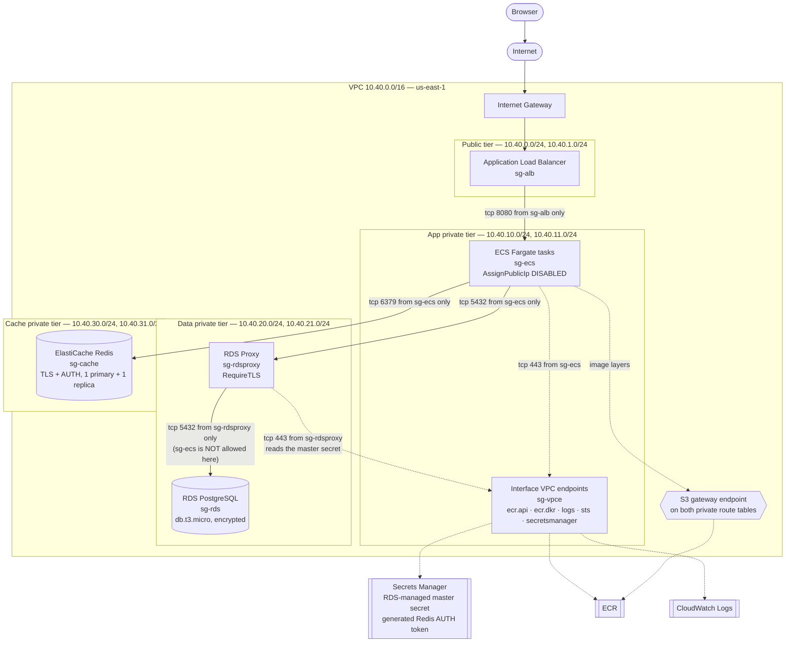
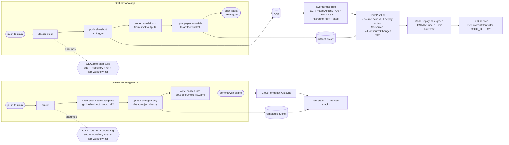
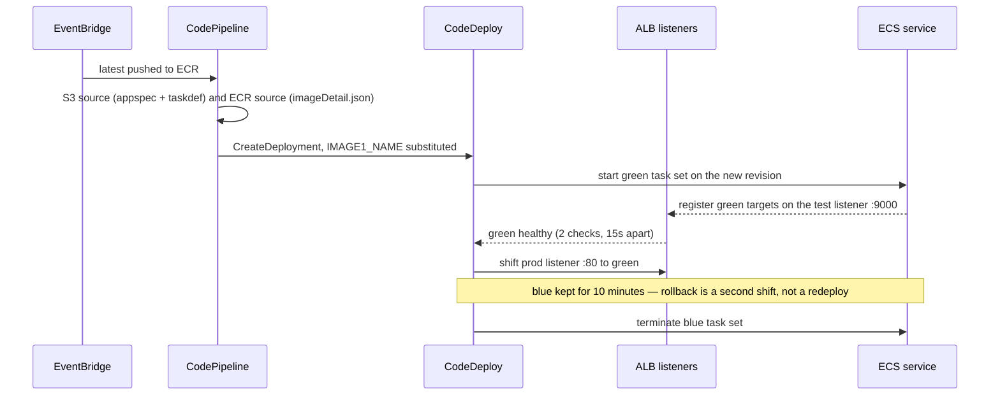

# Architecture

Source for the diagrams. Both render on GitHub as-is; paste either block into
<https://mermaid.live> to export SVG or PNG for a slide.

## 1. Network, subnet tiers and security groups

Every arrow is an allowed security group rule. There is no NAT gateway and no
route to the internet from any private subnet — the dashed arrows to the
interface endpoints are the only way out of the VPC.

### Security group rules in table form

| Group | Ingress | Egress |
|---|---|---|
| `sg-alb` | 80 from `0.0.0.0/0`; 9000 from `TestListenerCidr` | 8080 to `sg-ecs` |
| `sg-ecs` | 8080 from `sg-alb` | 5432 to `sg-rdsproxy`; 6379 to `sg-cache`; 443 to `sg-vpce` |
| `sg-rdsproxy` | 5432 from `sg-ecs` | 5432 to `sg-rds`; 443 to `sg-vpce` |
| `sg-rds` | 5432 from `sg-rdsproxy` **only** | none (`127.0.0.1/32` placeholder) |
| `sg-cache` | 6379 from `sg-ecs`; 6379 from `sg-cache` (replication) | 6379 to `sg-cache` |
| `sg-vpce` | 443 from `sg-ecs`; 443 from `sg-rdsproxy` | none (`127.0.0.1/32` placeholder) |

Every group declares explicit egress. A CloudFormation security group with no
`SecurityGroupEgress` silently gets allow-all to `0.0.0.0/0`, so the two groups
that never initiate a connection carry a `127.0.0.1/32` rule to suppress it.

## 2. CI/CD — two repos, two OIDC roles, one trigger

## 3. Blue/green traffic shift

