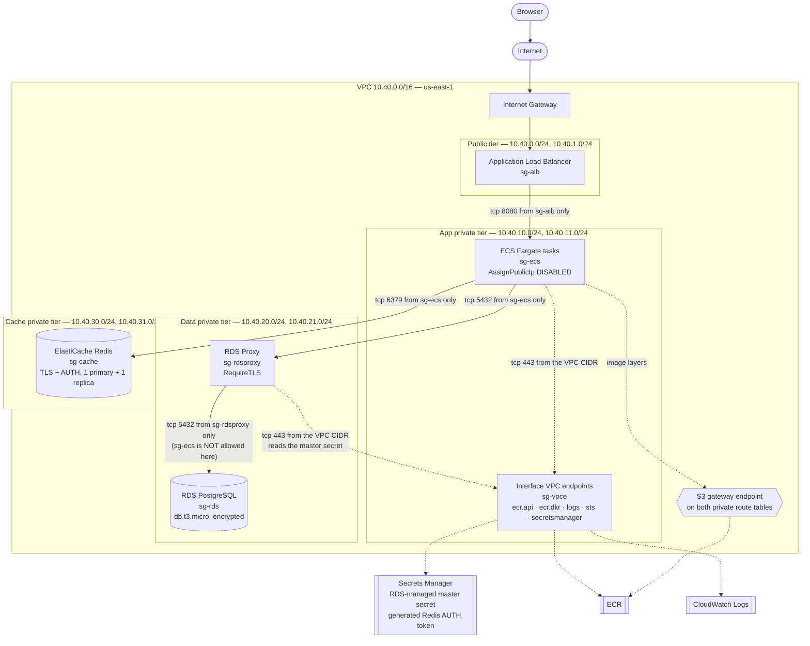
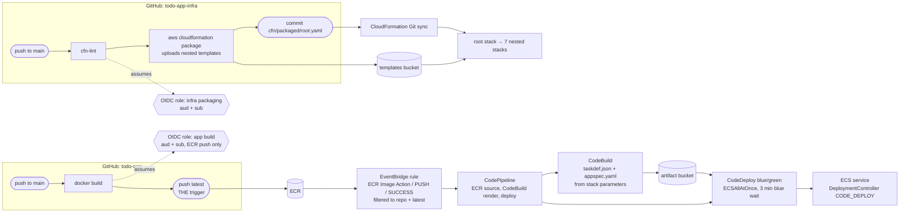
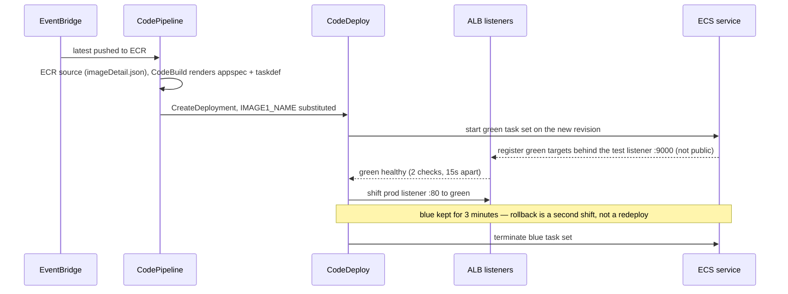

# Architecture

Source for the diagrams. Both render on GitHub as-is; paste either block into
<https://mermaid.live> to export SVG or PNG for a slide.

## 1. Network, subnet tiers and security groups

Every arrow is an allowed security group rule. There is no NAT gateway and no
route to the internet from any private subnet — the dashed arrows to the
interface endpoints are the only way out of the VPC.

```mermaid
flowchart TB
    internet([Internet])
    client([Browser])

    subgraph vpc["VPC 10.40.0.0/16 — us-east-1"]
        igw[Internet Gateway]

        subgraph public["Public tier — 10.40.0.0/24, 10.40.1.0/24"]
            alb["Application Load Balancer<br/>sg-alb"]
        end

        subgraph app["App private tier — 10.40.10.0/24, 10.40.11.0/24"]
            ecs["ECS Fargate tasks<br/>sg-ecs<br/>AssignPublicIp DISABLED"]
            vpce["Interface VPC endpoints<br/>sg-vpce<br/>ecr.api · ecr.dkr · logs · sts · secretsmanager"]
        end

        subgraph data["Data private tier — 10.40.20.0/24, 10.40.21.0/24"]
            proxy["RDS Proxy<br/>sg-rdsproxy<br/>RequireTLS"]
            rds[("RDS PostgreSQL<br/>sg-rds<br/>db.t3.micro, encrypted")]
        end

        subgraph cache["Cache private tier — 10.40.30.0/24, 10.40.31.0/24"]
            redis[("ElastiCache Redis<br/>sg-cache<br/>TLS + AUTH, 1 primary + 1 replica")]
        end

        s3gw{{"S3 gateway endpoint<br/>on both private route tables"}}
    end

    sm[["Secrets Manager<br/>RDS-managed master secret<br/>generated Redis AUTH token"]]
    ecr[["ECR"]]
    logs[["CloudWatch Logs"]]

    client --> internet --> igw --> alb
    alb -- "tcp 8080 from sg-alb only" --> ecs
    ecs -- "tcp 5432 from sg-ecs only" --> proxy
    proxy -- "tcp 5432 from sg-rdsproxy only<br/>(sg-ecs is NOT allowed here)" --> rds
    ecs -- "tcp 6379 from sg-ecs only" --> redis
    ecs -. "tcp 443 from the VPC CIDR" .-> vpce
    proxy -. "tcp 443 from the VPC CIDR<br/>reads the master secret" .-> vpce
    ecs -. "image layers" .-> s3gw

    vpce -.-> sm
    vpce -.-> ecr
    vpce -.-> logs
    s3gw -.-> ecr
```

### Security group rules in table form

| Group | Ingress |
|---|---|
| `sg-alb` | 80 from `0.0.0.0/0` |
| `sg-ecs` | 8080 from `sg-alb` |
| `sg-rdsproxy` | 5432 from `sg-ecs` |
| `sg-rds` | 5432 from `sg-rdsproxy` **only** |
| `sg-cache` | 6379 from `sg-ecs`; 6379 from `sg-cache` (replication) |
| `sg-vpce` | 443 from the VPC CIDR (`10.40.0.0/16`) |

Only ingress is declared. Security groups are stateful, so replies need no
egress rule, and the private subnets have no route to the internet in any case.
The test listener port (9000) is deliberately absent from `sg-alb`.

## 2. CI/CD — two repos, two OIDC roles, one trigger

```mermaid
flowchart LR
    subgraph infra["GitHub: todo-app-infra"]
        icommit([push to main]) --> ilint[cfn-lint]
        ilint --> iupload["aws cloudformation package<br/>uploads nested templates"]
        iupload --> ipush([commit cfn/packaged/root.yaml])
    end

    subgraph appgh["GitHub: todo-app"]
        acommit([push to main]) --> abuild[docker build]
        abuild --> alatest(["push latest<br/>THE trigger"])
    end

    role1{{"OIDC role: infra packaging<br/>aud + sub"}}
    role2{{"OIDC role: app build<br/>aud + sub, ECR push only"}}

    ilint -.assumes.-> role1
    abuild -.assumes.-> role2

    s3t[(templates bucket)]
    ecrrepo[(ECR)]
    s3a[(artifact bucket)]

    iupload --> s3t
    alatest --> ecrrepo

    ipush --> sync["CloudFormation Git sync"]
    sync --> stack["root stack → 7 nested stacks"]
    s3t --> stack

    ecrrepo --> eb["EventBridge rule<br/>ECR Image Action / PUSH / SUCCESS<br/>filtered to repo + latest"]
    eb --> pipe["CodePipeline<br/>ECR source, CodeBuild render, deploy"]
    pipe --> render["CodeBuild<br/>taskdef.json + appspec.yaml<br/>from stack parameters"]
    render --> s3a
    s3a --> cd
    pipe --> cd["CodeDeploy blue/green<br/>ECSAllAtOnce, 3 min blue wait"]
    cd --> svc["ECS service<br/>DeploymentController CODE_DEPLOY"]
```

## 3. Blue/green traffic shift

```mermaid
sequenceDiagram
    participant EB as EventBridge
    participant CP as CodePipeline
    participant CD as CodeDeploy
    participant ALB as ALB listeners
    participant ECS as ECS service

    EB->>CP: latest pushed to ECR
    CP->>CP: ECR source (imageDetail.json), CodeBuild renders appspec + taskdef
    CP->>CD: CreateDeployment, IMAGE1_NAME substituted
    CD->>ECS: start green task set on the new revision
    ECS-->>ALB: register green targets behind the test listener :9000 (not public)
    ALB-->>CD: green healthy (2 checks, 15s apart)
    CD->>ALB: shift prod listener :80 to green
    Note over CD,ECS: blue kept for 3 minutes — rollback is a second shift, not a redeploy
    CD->>ECS: terminate blue task set
```
